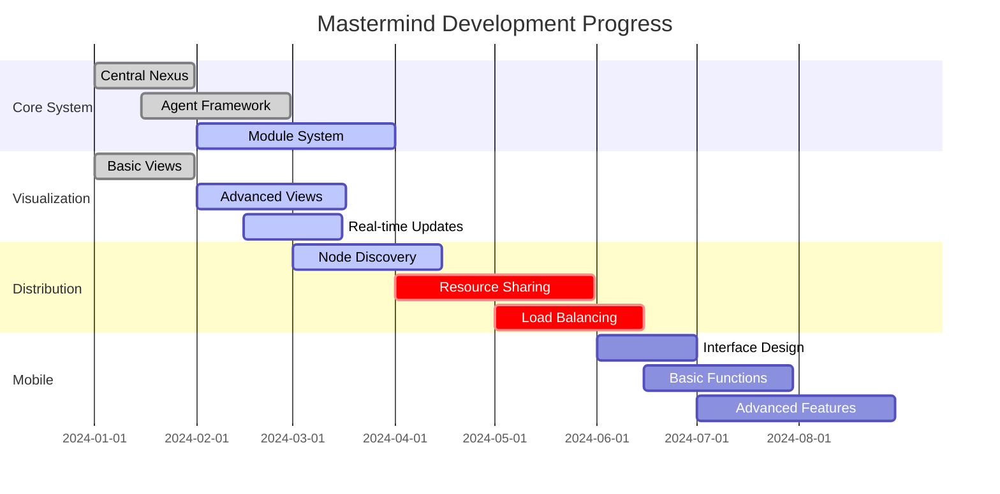
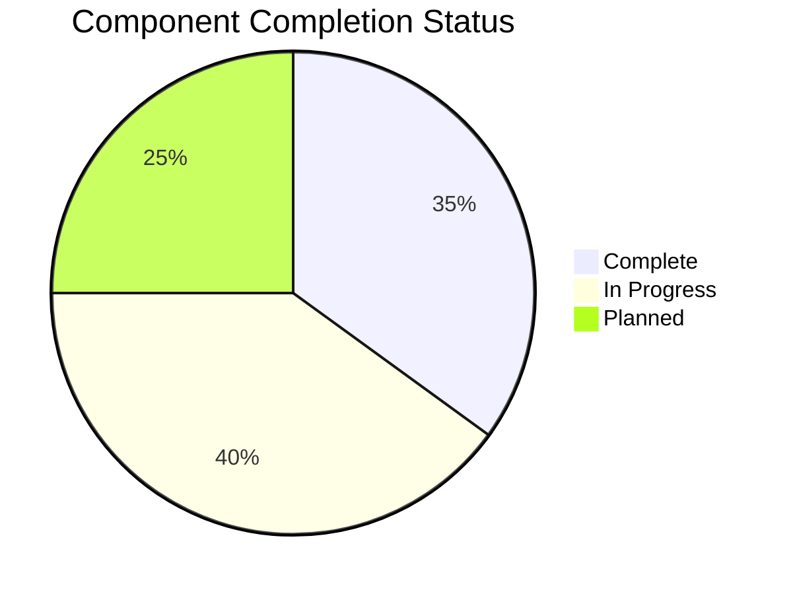
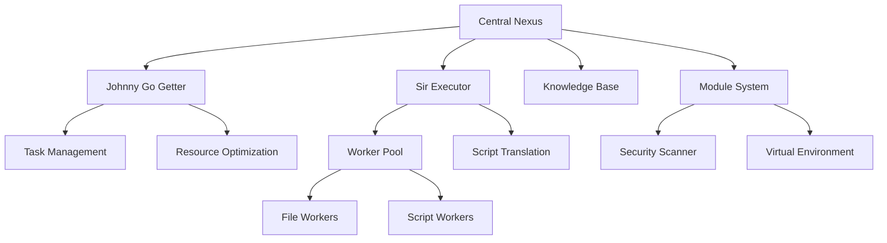

# Development Roadmap

## Phase 1: Foundation (Current)
- Core system implementation
- Basic agent framework
- Visualization system
- Configuration management
- Module system basics

## Phase 2: Enhancement
- Advanced agent capabilities
- Distributed computing basics
- Knowledge management
- Security improvements
- Mobile interface development

## Phase 3: Advanced Features
- AI model integration
- Advanced visualization
- Resource optimization
- Enhanced security
- Cross-platform support

## Phase 4: Scaling
- Global resource sharing
- Advanced automation
- Quantum computing support
- Self-evolution capabilities
- Advanced security features

## Visual Development Progress

## Component Status

## System Architecture

